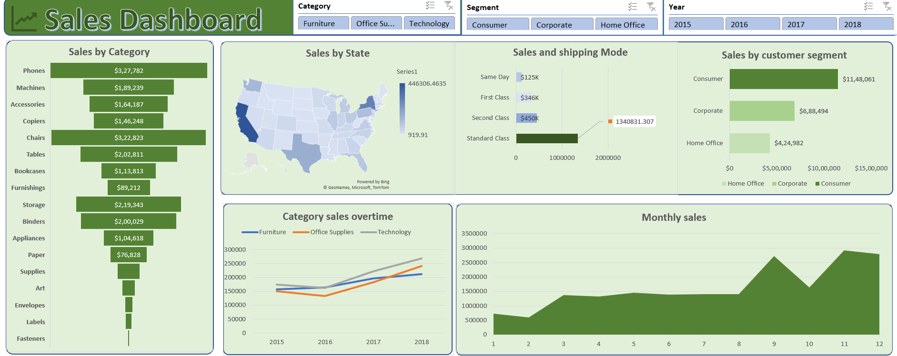

# 📊 Superstore Sales Data Analysis — Excel Dashboard

An interactive Excel dashboard analyzing sales performance of a superstore across regions, product categories, customer segments, and time periods. Built using real-world data sourced from Kaggle.

---

## 🎯 Project Objective

To analyze superstore sales data and uncover insights around:
- Sales performance by **product category and sub-category**
- **Geographic sales distribution** across US states
- **Customer segment** revenue breakdown (Consumer, Corporate, Home Office)
- **Shipping mode** impact on sales volume
- **Monthly and yearly sales trends** from 2015 to 2018

---

## 🛠️ Tools & Features Used

| Tool / Feature       | Purpose                                         |
|----------------------|-------------------------------------------------|
| Microsoft Excel      | Primary tool for analysis and visualization     |
| Pivot Tables         | Summarizing and aggregating sales data          |
| Slicers              | Interactive filters for Category, Segment, Year |
| Data Cleaning        | Removing duplicates, fixing inconsistencies     |
| Data Formatting      | Consistent number, date, and cell formatting    |
| Charts               | 6 visual charts across the dashboard            |

---

## 📁 Dataset

- **Type:** Retail sales transaction data (2015–2018)
- **Contains:** Orders, customers, products, regions, shipping details, profit & sales figures

---

## 📈 Dashboard Visuals

The dashboard contains **6 interactive charts** controlled by **3 slicers**:

| Chart | Type | Description |
|---|---|---|
| Sales by Category | Horizontal Bar | Sub-category level sales (Phones, Chairs, Machines...) |
| Sales by State | Map Chart | Geographic sales heatmap across US states |
| Sales and Shipping Mode | Bar Chart | Sales volume & order count by shipping class |
| Sales by Customer Segment | Horizontal Bar | Revenue split — Consumer, Corporate, Home Office |
| Category Sales Over Time | Line Chart | Yearly trend per category from 2015–2018 |
| Monthly Sales | Area Chart | Month-by-month sales volume across the year |

**Slicers:** Category · Segment · Year

---

## 💡 Key Insights

1. **Phones** are the top-selling sub-category with **$3,27,782** in sales, followed closely by **Chairs** at **$3,22,823**
2. **Standard Class** shipping dominates with over **$1.34 million** in sales — the most used and profitable shipping mode
3. **Consumer segment** drives the highest revenue at **$11,48,061**, more than Corporate and Home Office combined
4. Sales show a **consistent upward trend** from 2015 to 2018 across all categories
5. **Monthly sales spike** significantly from month 9 onwards, indicating strong Q4 seasonality

---

## 📂 Project Structure

```
superstore-sales-dashboard/
│
├── superstore_dashboard.xlsx   # Main Excel file with data, pivots & dashboard
├── dashboard_screenshot.png    # Dashboard preview image
└── README.md                   # Project documentation
```

---

## 🖼️ Dashboard Preview



---

## 🚀 How to Use

1. Download or clone this repository
2. Open `superstore_dashboard.xlsx` in Microsoft Excel (2016 or later recommended)
3. Navigate to the **Dashboard** sheet
4. Use the **Slicers** (Category, Segment, Year) to filter all charts interactively


---

*This project was built as part of a data analytics portfolio to demonstrate skills in Excel-based data analysis, dashboard design, and business storytelling.*
